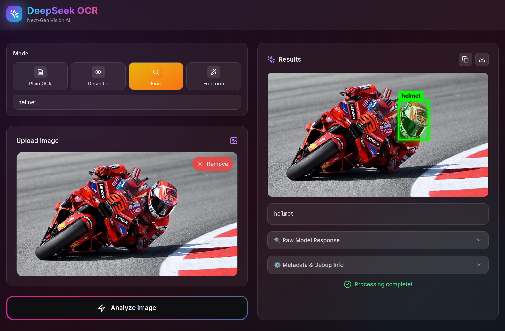
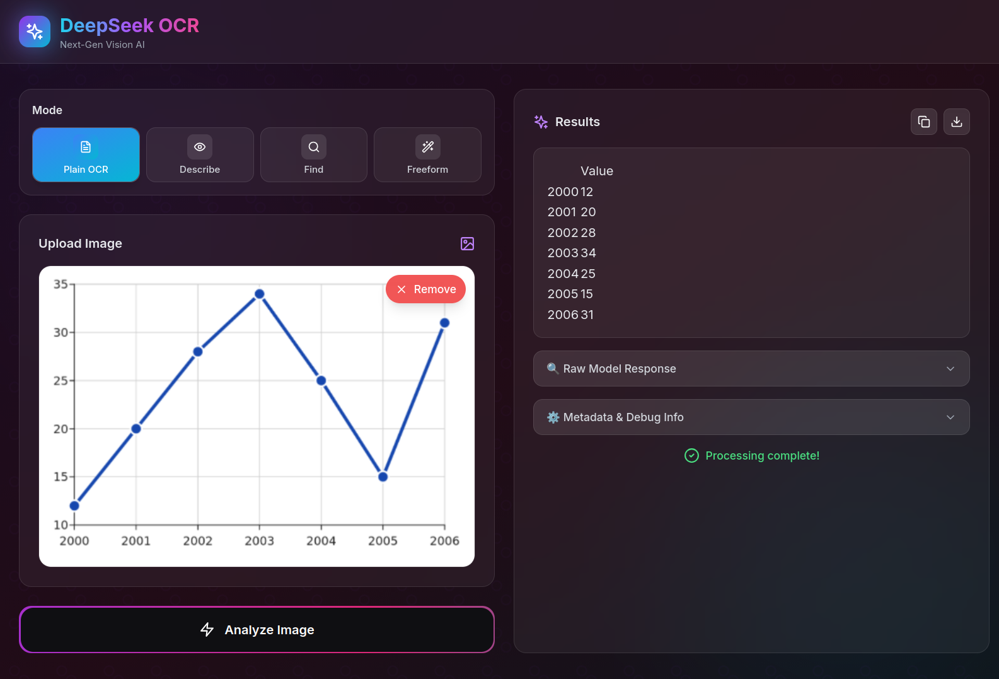
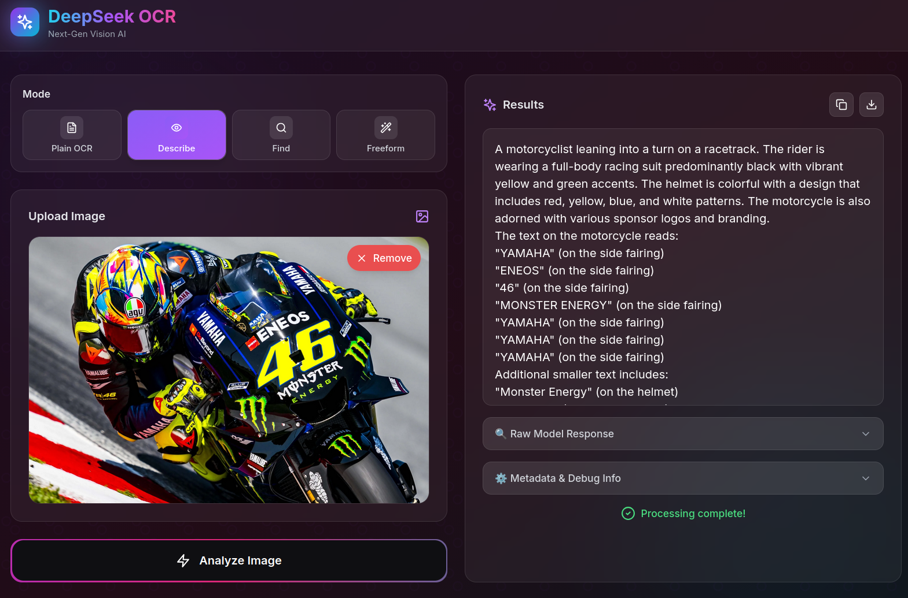

# 🚀 DeepSeek OCR - React + FastAPI

Modern OCR web application powered by DeepSeek-OCR with a stunning React frontend and FastAPI backend.


> **Recent Updates (v2.2.0)**
> - ✅ **NEW: PDF Support** - Upload and extract text from PDF documents (multi-page support)
> - ✅ Fixed image removal button - now properly clears and allows re-upload
> - ✅ Fixed multiple bounding boxes parsing - handles `[[x1,y1,x2,y2], [x1,y1,x2,y2]]` format
> - ✅ Simplified to 4 core working modes for better stability
> - ✅ Fixed bounding box coordinate scaling (normalized 0-999 → actual pixels)
> - ✅ Fixed HTML rendering (model outputs HTML, not Markdown)
> - ✅ Increased file upload limit to 100MB (configurable)
> - ✅ Added .env configuration support

## Quick Start

1. **Clone and configure:**
   ```bash
   git clone <repository-url>
   cd deepseek_ocr_app
   
   # Copy and customize environment variables
   cp .env.example .env
   # Edit .env to configure ports, upload limits, etc.
   ```

2. **Start the application:**
   ```bash
   docker compose up --build
   ```

   The first run will download the model (~5-10GB), which may take some time.

3. **Access the application:**
   - **Frontend**: http://localhost:3000 (or your configured FRONTEND_PORT)
   - **Backend API**: http://localhost:8000 (or your configured API_PORT)
   - **API Docs**: http://localhost:8000/docs

## Features

### 4 Core OCR Modes
- **Plain OCR** - Raw text extraction from any image or PDF
- **Describe** - Generate intelligent image descriptions
- **Find** - Locate specific terms with visual bounding boxes
- **Freeform** - Custom prompts for specialized tasks

### File Support
- 📄 **PDF Documents** - Multi-page PDF support with automatic page-by-page processing
- 🖼️ **Images** - PNG, JPG, JPEG, WEBP, GIF, BMP formats
- 📊 **Large Files** - Up to 100MB file size (configurable)

### UI Features
- 🎨 Glass morphism design with animated gradients
- 🎯 Drag & drop file upload (images and PDFs)
- 🗑️ Easy file removal and re-upload
- 📦 Grounding box visualization with proper coordinate scaling
- ✨ Smooth animations (Framer Motion)
- 📋 Copy/Download results
- 🎛️ Advanced settings dropdown
- 📝 HTML and Markdown rendering for formatted output
- 🔍 Multiple bounding box support (handles multiple instances of found terms)

## Configuration

The application can be configured via the `.env` file:

```bash
# API Configuration
API_HOST=0.0.0.0
API_PORT=8000

# Frontend Configuration
FRONTEND_PORT=3000

# Model Configuration
MODEL_NAME=deepseek-ai/DeepSeek-OCR
HF_HOME=/models

# Upload Configuration
MAX_UPLOAD_SIZE_MB=100  # Maximum file upload size

# Processing Configuration
BASE_SIZE=1024         # Base processing resolution
IMAGE_SIZE=640         # Tile processing resolution
CROP_MODE=true         # Enable dynamic cropping for large images
```

### Environment Variables

- `API_HOST`: Backend API host (default: 0.0.0.0)
- `API_PORT`: Backend API port (default: 8000)
- `FRONTEND_PORT`: Frontend port (default: 3000)
- `MODEL_NAME`: HuggingFace model identifier
- `HF_HOME`: Model cache directory
- `MAX_UPLOAD_SIZE_MB`: Maximum file upload size in megabytes
- `BASE_SIZE`: Base image processing size (affects memory usage)
- `IMAGE_SIZE`: Tile size for dynamic cropping
- `CROP_MODE`: Enable/disable dynamic image cropping

## Tech Stack

- **Frontend**: React 18 + Vite 5 + TailwindCSS 3 + Framer Motion 11
- **Backend**: FastAPI + PyTorch + Transformers 4.46 + DeepSeek-OCR
- **Configuration**: python-decouple for environment management
- **Server**: Nginx (reverse proxy)
- **Container**: Docker + Docker Compose with multi-stage builds
- **GPU**: NVIDIA CUDA support (tested on RTX 3090, RTX 5090)

## Project Structure

```
deepseek-ocr/
├── backend/           # FastAPI backend
│   ├── main.py
│   ├── requirements.txt
│   └── Dockerfile
├── frontend/          # React frontend
│   ├── src/
│   │   ├── components/
│   │   ├── App.jsx
│   │   └── main.jsx
│   ├── package.json
│   ├── nginx.conf
│   └── Dockerfile
├── models/            # Model cache
└── docker-compose.yml
```

## Development

Docker compose cycle to test:
```bash
docker compose down
docker compose up --build
```

## Requirements

### Hardware
- NVIDIA GPU with CUDA support
  - Recommended: RTX 3090, RTX 4090, RTX 5090, or better
  - Minimum: 8-12GB VRAM for the model
  - More VRAM always good!

### Software
- **Docker & Docker Compose** (latest version recommended)

- **NVIDIA Driver** - Installing NVIDIA Drivers on Ubuntu (Blackwell/RTX 5090)

  **Note**: Getting NVIDIA drivers working on Blackwell GPUs can be a pain! Here's what worked:

  The key requirements for RTX 5090 on Ubuntu 24.04:
  - Use the open-source driver (nvidia-driver-570-open or newer, like nvidia-driver-580-open)
  - Upgrade to kernel 6.11+ (6.14+ recommended for best stability)
  - Enable Resize Bar in BIOS/UEFI (critical!)

  **Step-by-Step Instructions:**

  1. Install NVIDIA Open Driver (580 or newer)
     ```bash
     sudo add-apt-repository ppa:graphics-drivers/ppa
     sudo apt update
     sudo apt remove --purge nvidia*
     sudo nvidia-installer --uninstall  # If you have it
     sudo apt autoremove
     sudo apt install nvidia-driver-580-open
     ```

  2. Upgrade Linux Kernel to 6.11+ (for Ubuntu 24.04 LTS)
     ```bash
     sudo apt install --install-recommends linux-generic-hwe-24.04 linux-headers-generic-hwe-24.04
     sudo update-initramfs -u
     sudo apt autoremove
     ```

  3. Reboot
     ```bash
     sudo reboot
     ```

  4. Enable Resize Bar in UEFI/BIOS
     - Restart and enter UEFI (usually F2, Del, or F12 during boot)
     - Find and enable "Resize Bar" or "Smart Access Memory"
     - This will also enable "Above 4G Decoding" and disable "CSM" (Compatibility Support Module)—that's expected!
     - Save and exit

  5. Verify Installation
     ```bash
     nvidia-smi
     ```
     You should see your RTX 5090 listed!

  💡 **Why open drivers?** I dunno, but the open drivers have better support for Blackwell GPUs. Without Resize Bar enabled, you'll get a black screen even with correct drivers!

  Credit: Solution adapted from [this Reddit thread](https://www.reddit.com/r/linux_gaming/comments/1i3h4gn/blackwell_on_linux/).

- **NVIDIA Container Toolkit** (required for GPU access in Docker)
  - Installation guide: https://docs.nvidia.com/datacenter/cloud-native/container-toolkit/latest/install-guide.html

### System Requirements
- ~20GB free disk space (for model weights and Docker images)
- 16GB+ system RAM recommended
- Fast internet connection for initial model download (~5-10GB)

## Known Issues & Fixes

### ✅ FIXED: Image removal and re-upload (v2.1.1)
- **Issue**: Couldn't remove uploaded image and upload a new one
- **Fix**: Added prominent "Remove" button that clears image state and allows fresh upload

### ✅ FIXED: Multiple bounding boxes (v2.1.1)
- **Issue**: Only single bounding box worked, multiple boxes like `[[x1,y1,x2,y2], [x1,y1,x2,y2]]` failed
- **Fix**: Updated parser to handle both single and array of coordinate arrays using `ast.literal_eval`

### ✅ FIXED: Grounding box coordinate scaling (v2.1)
- **Issue**: Bounding boxes weren't displaying correctly
- **Cause**: Model outputs coordinates normalized to 0-999, not actual pixel dimensions
- **Fix**: Backend now properly scales coordinates using the formula: `actual_coord = (normalized_coord / 999) * image_dimension`

### ✅ FIXED: HTML vs Markdown rendering (v2.1)
- **Issue**: Output was being rendered as Markdown when model outputs HTML
- **Cause**: Model is trained to output HTML (especially for tables)
- **Fix**: Frontend now detects and renders HTML properly using `dangerouslySetInnerHTML`

### ✅ FIXED: Limited upload size (v2.1)
- **Issue**: Large images couldn't be uploaded
- **Fix**: Increased nginx `client_max_body_size` to 100MB (configurable via .env)

### ⚠️ Simplified Mode Selection (v2.1.1)
- **Change**: Reduced from 12 modes to 4 core working modes
- **Reason**: Advanced modes (tables, layout, PII, multilingual) need additional testing
- **Working modes**: Plain OCR, Describe, Find, Freeform
- **Future**: Additional modes will be re-enabled after thorough testing

## How the Model Works

### Coordinate System
The DeepSeek-OCR model uses a normalized coordinate system (0-999) for bounding boxes:
- All coordinates are output in range [0, 999]
- Backend scales: `pixel_coord = (model_coord / 999) * actual_dimension`
- This ensures consistency across different image sizes

### Dynamic Cropping
For large images, the model uses dynamic cropping:
- Images ≤640x640: Direct processing
- Larger images: Split into tiles based on aspect ratio
- Global view (BASE_SIZE) + Local views (IMAGE_SIZE tiles)
- See `process/image_process.py` for implementation details

### Output Format
- Plain text modes: Return raw text
- Table modes: Return HTML tables or CSV
- JSON modes: Return structured JSON
- Grounding modes: Return text with `<|ref|>label<|/ref|><|det|>[[coords]]<|/det|>` tags

## API Usage

### POST /api/ocr

**Parameters:**
- `image` (file, required) - Image or PDF file to process (up to 100MB)
- `mode` (string) - OCR mode: `plain_ocr` | `describe` | `find_ref` | `freeform`
- `prompt` (string) - Custom prompt for freeform mode
- `grounding` (bool) - Enable bounding boxes (auto-enabled for find_ref)
- `find_term` (string) - Term to locate in find_ref mode (supports multiple matches)
- `base_size` (int) - Base processing size (default: 1024)
- `image_size` (int) - Tile size for cropping (default: 640)
- `crop_mode` (bool) - Enable dynamic cropping (default: true)
- `include_caption` (bool) - Add image description (default: false)

**Response (Single Image/Page):**
```json
{
  "success": true,
  "text": "Extracted text or HTML output...",
  "boxes": [{"label": "field", "box": [x1, y1, x2, y2]}],
  "image_dims": {"w": 1920, "h": 1080},
  "is_pdf": false,
  "metadata": {
    "mode": "plain_ocr",
    "grounding": false,
    "base_size": 1024,
    "image_size": 640,
    "crop_mode": true
  }
}
```

**Response (Multi-page PDF):**
```json
{
  "success": true,
  "text": "--- Page 1 ---\nText from page 1\n--- Page 2 ---\nText from page 2...",
  "boxes": [],
  "image_dims": {"w": 1920, "h": 1080},
  "is_pdf": true,
  "pages": [
    {
      "page": 1,
      "text": "Text from page 1...",
      "boxes": [],
      "image_dims": {"w": 1920, "h": 1080}
    },
    {
      "page": 2,
      "text": "Text from page 2...",
      "boxes": [],
      "image_dims": {"w": 1920, "h": 1080}
    }
  ],
  "metadata": {
    "mode": "plain_ocr",
    "grounding": false,
    "base_size": 1024,
    "image_size": 640,
    "crop_mode": true,
    "total_pages": 2
  }
}
```

**Note on PDF Processing:**
- PDFs are automatically converted to images (144 DPI by default)
- Each page is processed independently
- Multi-page results combine text with page separators
- Bounding boxes are available per-page in the `pages` array

**Note on Bounding Boxes:**
- The model outputs coordinates normalized to 0-999
- The backend automatically scales them to actual image dimensions
- Coordinates are in [x1, y1, x2, y2] format (top-left, bottom-right)
- **Supports multiple boxes**: When finding multiple instances, format is `[[x1,y1,x2,y2], [x1,y1,x2,y2], ...]`
- Frontend automatically displays all boxes overlaid on the image with unique colors

## Examples

Here are some example images showcasing different OCR capabilities:

### Visual Understanding


### Table Extraction from Chart


### Image Description


## Troubleshooting

### GPU not detected
```bash
nvidia-smi
docker run --rm --gpus all nvidia/cuda:11.8.0-base-ubuntu22.04 nvidia-smi
```

### Port conflicts
```bash
sudo lsof -i :3000
sudo lsof -i :8000
```

### Frontend build issues
```bash
cd frontend
rm -rf node_modules package-lock.json
docker-compose build frontend
```

## License

This project uses the DeepSeek-OCR model. Refer to the model's license terms.


<!-- Small note and direct link to license at the bottom -->
<!-- MIT License: this repository is licensed under the MIT License. See the full text in the LICENSE file. -->
Note: Licensed under the MIT License. View the full license: [LICENSE](./LICENSE)